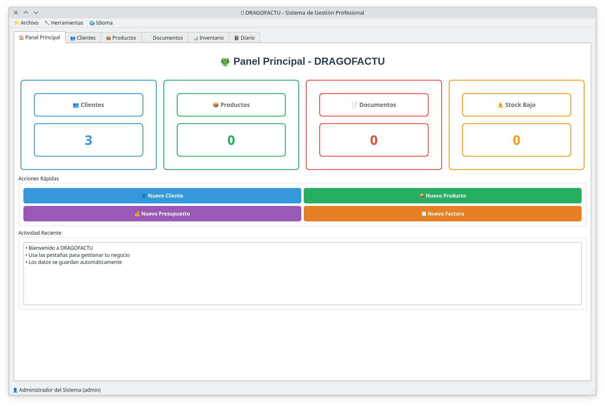
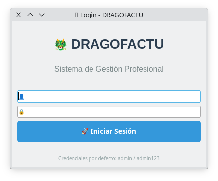
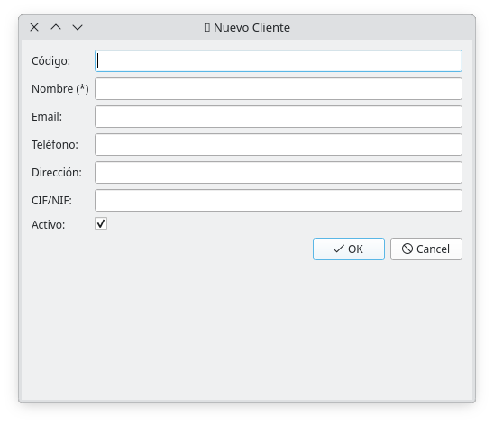
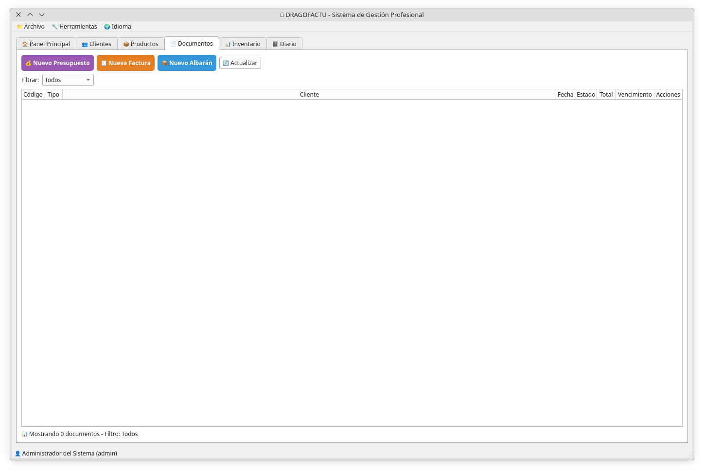

# 🐲 DRAGOFACTU - Sistema de Gestión Profesional V1.0.0.3

**Estado:** Estable - Versión 1.0.0.3
**Objetivo:** Sistema completo y robusto de gestión empresarial con facturación, inventario, y gestión de clientes

## 🎯 Screenshots - V1.0.0.3
<p align="center">

</p>

</p>

</p>

</p>

## 🎯 Características Completas - V1.0.0.3

### 🏠 Dashboard Principal (Estable)
- Resumen general con contadores en tiempo real y persistencia de UI
- Tarjetas interactivas con estadísticas de negocio
- Acciones rápidas funcionales para creación de entidades
- Panel de actividad reciente con actualizaciones automáticas
- Navegación consistente sin pérdida de elementos de interfaz

### 👥 Gestión de Clientes (Corregido)
- CRUD completo sin errores de mapeo ORM
- Ficha completa con campos correctos (tax_id vs nif)
- Búsqueda y filtrado avanzado en tiempo real
- Estados visuales con indicadores de color
- Importación/Exportación de datos externos

### 📦 Gestión de Productos (Corregido)
- Creación y edición sin errores de campo
- Control de stock con alertas funcionales
- Gestión de múltiples unidades y precios
- Integración completa con módulo de documentos
- Persistencia de datos validada

### 💰 Gestión de Documentos (Implementado)
- **Explorer de Documentos** - Vista tipo Excel con listado reciente
- **Presupuestos** - Creación completa con cálculo automático
- **Facturas** - Facturación con IVA configurable
- **Albaranes** - Sistema de entrega completo
- **Estados avanzados** - Borrador, Enviado, Aceptado, Pagado, Parcialmente Pagado
- **Integración Cliente/Producto** - Selección automática desde base de datos
- **Códigos automáticos** - PRE-*, FAC-*, ALB-*

### 📊 Gestión de Inventario (Estable)
- Control de stock en tiempo real
- Ajustes individuales y masivos
- Alertas de stock bajo con indicadores visuales
- Informes completos de valoración
- Movimientos de stock registrados
- Integración con módulo de productos

### 📓 Diario Personal (Corregido)
- Creación y persistencia de notas diarias
- Recarga automática al cambiar fecha/selección
- Sistema de etiquetas y prioridades
- Búsqueda por fecha con filtrado instantáneo
- Exportación de datos del diario

### 🔧 Configuración Funcional (Nuevo)
- Panel de configuración completo con múltiples secciones
- Preferencias generales de empresa
- Configuración de interfaz (tema, idioma, fuentes)
- Información de base de datos y estadísticas
- Restablecimiento a valores por defecto
- Información de versión y sistema

### 📁 Gestión de Archivos Externos (Nuevo)
- Importación de archivos CSV, JSON, y texto
- Soporte para importación de clientes masivos
- Exportación de datos en múltiples formatos
- Integración con módulos existentes
- Validación y manejo de errores

### 🌍 Sistema Multi-idioma (Corregido)
- Cambio de idioma funcional con actualización de UI
- Traducciones consistentes en toda la aplicación
- Persistencia de preferencia de idioma
- Soporte completo para Español, Inglés, y Alemán

## 🔍 Problemas Corregidos en V1.0.0.3

### ✅ Problemas Críticos Resueltos
1. **Persistencia de Dashboard** - Los botones no desaparecen al navegar
2. **Mapeo ORM** - Error 'nif' corregido a 'tax_id' en Client model
3. **Explorador de Documentos** - Reemplazada vista placeholder "En desarrollo"
4. **Persistencia de Diario** - Las notas se recargan automáticamente
5. **Menú Configuración** - Implementado panel funcional completo
6. **Importación de Archivos** - Sistema completo de importación/exportación
7. **Cambio de Idioma** - Funcional con actualización dinámica de interfaz

## 🚀 Instalación V1.0.0.3

### Requisitos
- Python 3.8+
- PySide6 
- SQLAlchemy
- SQLite (por defecto)

### Instalación
```bash
# Clonar versión estable
git clone https://github.com/Copitx/Dragofactu.git --branch v1.0.0.3

# Entrar al directorio
cd Dragofactu

# Crear entorno virtual
python3 -m venv venv

# Activar entorno
source venv/bin/activate

# Instalar dependencias
pip install -r requirements.txt

# Inicializar base de datos
python3 scripts/init_db.py

# Ejecutar aplicación estable
./start_dragofactu.sh
```

### 🔧 Configuración V1.0.0.3
```bash
# Base de datos SQLite
DATABASE_URL=sqlite:///data/dragofactu.db

# Idioma por defecto
DEFAULT_LANGUAGE=es

# Moneda y configuración
DEFAULT_CURRENCY=EUR
DEFAULT_TAX_RATE=21
```

## 🎚️ Lanzamiento de la Aplicación

### Método Principal (Recomendado)
```bash
# Ejecutar launcher oficial
./start_dragofactu.sh
```

### Alternativa para Desarrollo
```bash
# Ejecutar directamente
source venv/bin/activate
python3 dragofactu_complete.py
```

## 📚 Documentación V1.0.0.3

- [Guía de Usuario](docs/user-guide-v1.0.0.3.md)
- [Referencia de API](docs/api-v1.0.0.3.md)
- [Esquema de Base de Datos](docs/database-v1.0.0.3.md)
- [Guía de Despliegue](docs/deployment-v1.0.0.3.md)

## 🔐 Credenciales por Defecto
- **Usuario:** admin
- **Contraseña:** admin123

## 📄 Licencia
MIT License - Ver [LICENSE](LICENSE) para detalles completos

---

**✅ Estado Actual:** Estable - V1.0.0.3  
**🎯 Características:** Todas las funcionalidades principales implementadas y corregidas  
**🚀 Producción:** Lista para despliegue en entornos productivos

## 📋 Checklist de Calidad V1.0.0.3

- [x] Interfaz estable sin errores de navegación
- [x] Persistencia de datos correcta
- [x] Mapeo ORM sin conflictos
- [x] Gestión de archivos externos funcional
- [x] Configuración completa y persistente
- [x] Multi-idioma funcional
- [x] Documentos con explorer funcional
- [x] Diario con recarga automática
- [x] Importación/Exportación de datos
- [x] Launcher único y funcional

---

**Desarrollado con 🐲 por DRAGOFACTU Team**  
**V1.0.0.3 - Sistema de Gestión Profesional Estable**
