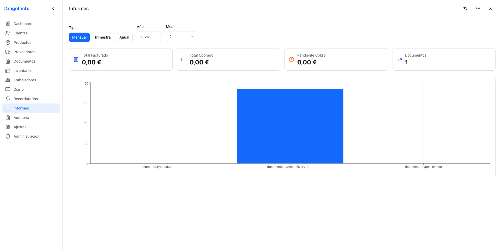
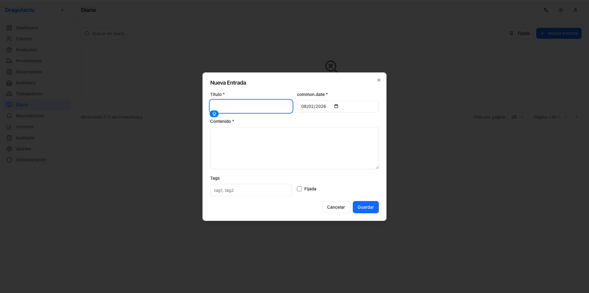
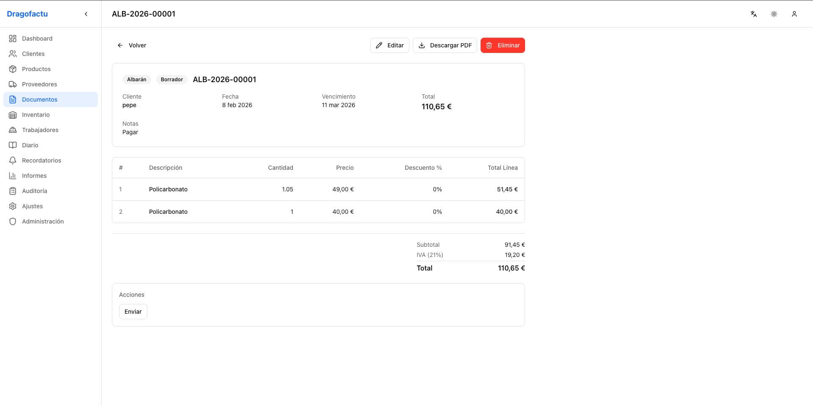
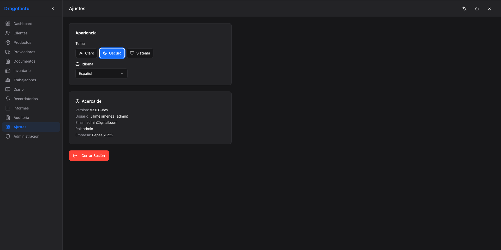
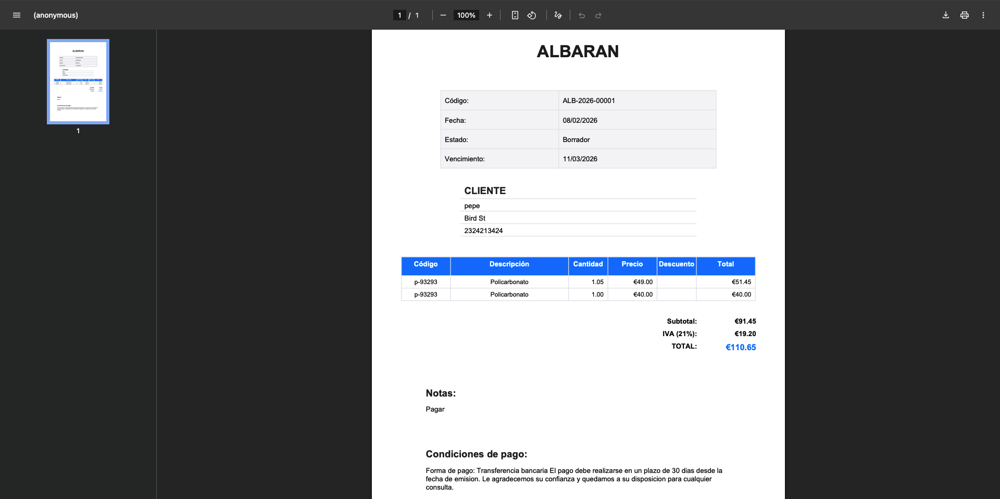

<p align="center">
  <h1 align="center">DRAGOFACTU</h1>
  <p align="center">
    <strong>Sistema de Gestion Empresarial Multi-Plataforma</strong>
  </p>
  <p align="center">
    <a href="https://dragofactu-production.up.railway.app"></a>
    
    
    
    
  </p>
</p>

---

## Descripcion General

Dragofactu es un **ERP completo** para gestion empresarial, disponible como aplicacion de escritorio, aplicacion web y API REST. Permite gestionar facturacion, inventario, clientes, proveedores, trabajadores y mucho mas, con soporte multi-idioma y modo offline.

```
                          ┌──────────────────────┐
 ┌────────────────┐       │                      │       ┌──────────────────┐
 │  Desktop App   │──JWT─▶│   FastAPI Backend     │◀─────▶│   PostgreSQL     │
 │  (PySide6)     │       │                      │       │   (Railway)      │
 └────────────────┘       │  Multi-tenant Auth   │       └──────────────────┘
                          │  50+ REST Endpoints  │
 ┌────────────────┐       │  144 Tests           │
 │  Frontend Web  │──JWT─▶│                      │
 │  (React + TS)  │       └──────────────────────┘
 └────────────────┘
```

---
## 📸 Screenshots v2

| Tool | Preview |
| :--- | :--- |
| **Dashboard** |  |
| **Stats Tool** |  |
| **Diary** |  |
| **Factura** |  |
| **Providers** |  |
| **Settings** |  |
| **PDF Tool** |  |


## Funcionalidades

| Modulo | Descripcion |
|--------|-------------|
| **Facturacion** | Presupuestos, albaranes y facturas con workflow de estados |
| **Inventario** | Control de stock con alertas, ajustes y deduccion automatica |
| **Clientes** | CRUD completo con busqueda, paginacion y filtros |
| **Proveedores** | Gestion de proveedores con datos de contacto |
| **Productos** | Catalogo con precios, categorias y stock minimo |
| **Trabajadores** | Gestion de personal, departamentos y cursos de formacion |
| **Diario** | Notas con pins, fechas y etiquetas |
| **Recordatorios** | Alertas con prioridad, vencimiento e indicador overdue |
| **Informes** | Reportes financieros mensuales, trimestrales y anuales |
| **Export/Import** | CSV para clientes, productos y proveedores |
| **Audit Log** | Registro completo de todas las acciones del sistema |
| **Multi-idioma** | Espanol, Ingles y Aleman con cambio en vivo |
| **Dark Mode** | Tema claro, oscuro y automatico (sistema) |
| **Cache Offline** | Desktop funciona sin conexion con sincronizacion posterior |
| **PWA** | App web instalable con Service Worker y cache offline |

---

## Stack Tecnologico

### Backend
| Tecnologia | Uso |
|------------|-----|
| **FastAPI** | Framework API REST |
| **PostgreSQL** | Base de datos (produccion) |
| **SQLAlchemy 2.0** | ORM con multi-tenancy |
| **Pydantic v2** | Validacion de schemas |
| **bcrypt + JWT** | Autenticacion con refresh tokens |
| **pytest** | Testing (144 tests) |
| **Railway** | Hosting en produccion |

### Frontend Web
| Tecnologia | Uso |
|------------|-----|
| **React 18** | UI Library |
| **TypeScript** | Type safety |
| **Vite 5** | Build tool |
| **TailwindCSS** | Estilos utility-first |
| **shadcn/ui** | Componentes UI accesibles |
| **TanStack Query v5** | API state management |
| **Zustand** | Client state (auth, UI) |
| **react-hook-form + Zod** | Formularios con validacion |
| **react-i18next** | Internacionalizacion |

### Desktop
| Tecnologia | Uso |
|------------|-----|
| **PySide6 (Qt6)** | GUI nativa |
| **ReportLab** | Generacion de PDF |
| **Cache offline** | Cola de operaciones + sync |

---

## Inicio Rapido

### Frontend Web (Desarrollo)

```bash
cd frontend
npm install
npm run dev
# → http://localhost:5173
```

### Backend API (Local)

```bash
cd backend
python -m venv venv && source venv/bin/activate
pip install -r requirements.txt
uvicorn app.main:app --reload --port 8000
# API → http://localhost:8000
# Docs → http://localhost:8000/docs
```

### Desktop

```bash
./start_dragofactu.sh
```

> **Credenciales por defecto:** `admin` / `admin123`

---

## Estructura del Proyecto

```
Dragofactu/
│
├── backend/                         # FastAPI Backend (Produccion)
│   ├── app/
│   │   ├── api/v1/                  # Endpoints REST (50+)
│   │   ├── models/                  # SQLAlchemy ORM (11 modelos)
│   │   ├── schemas/                 # Pydantic v2 schemas
│   │   ├── core/                    # Seguridad, config, DB
│   │   └── main.py                  # FastAPI entry point
│   └── tests/                       # 144 tests pytest
│
├── frontend/                        # React Web Client (En desarrollo)
│   ├── src/
│   │   ├── api/                     # Axios clients por entidad
│   │   ├── components/              # shadcn/ui + layout + data-table
│   │   │   ├── ui/                  # Componentes base (button, dialog, etc.)
│   │   │   ├── layout/              # Sidebar, header, mobile nav
│   │   │   ├── data-table/          # DataTable generico reutilizable
│   │   │   ├── document-editor/     # Line editor, status badge, totals
│   │   │   └── forms/               # Confirm dialog
│   │   ├── hooks/                   # TanStack Query hooks
│   │   ├── stores/                  # Zustand (auth, ui)
│   │   ├── pages/                   # Lazy-loaded pages (CRUD)
│   │   ├── i18n/                    # es.json, en.json, de.json
│   │   ├── types/                   # TypeScript interfaces
│   │   └── lib/                     # Utils, validators (Zod), constants
│   ├── vite.config.ts               # Proxy API → Railway
│   └── tailwind.config.ts           # Paleta Dragofactu
│
├── dragofactu/                      # Desktop Client (PySide6)
│   ├── services/api_client.py       # Cliente HTTP con cache offline
│   ├── models/                      # ORM models
│   ├── ui/                          # Componentes Qt
│   └── config/                      # Traduccion, settings
│
├── Dockerfile                          # Multi-stage build (Node + Python)
├── dragofactu_complete.py              # App monolitica desktop
└── start_dragofactu.sh                 # Entry point desktop
```

---

## API REST

### Autenticacion

| Metodo | Endpoint | Descripcion |
|--------|----------|-------------|
| `POST` | `/api/v1/auth/register` | Registrar empresa + admin |
| `POST` | `/api/v1/auth/login` | Login → JWT tokens |
| `POST` | `/api/v1/auth/refresh` | Renovar access token |
| `GET` | `/api/v1/auth/me` | Info usuario actual |

### Recursos CRUD

Todos los recursos requieren JWT y soportan `GET` (lista paginada), `POST` (crear), `GET /:id` (detalle), `PUT /:id` (actualizar), `DELETE /:id` (soft delete).

| Recurso | Extras |
|---------|--------|
| `/api/v1/clients` | Busqueda por nombre, paginacion |
| `/api/v1/products` | Categorias, stock, `POST /:id/adjust-stock` |
| `/api/v1/suppliers` | Busqueda, paginacion |
| `/api/v1/documents` | Workflow estados, `POST /:id/change-status`, conversion |
| `/api/v1/workers` | Departamentos, cursos sub-recurso |
| `/api/v1/diary` | Pin toggle, filtro por fecha |
| `/api/v1/reminders` | Prioridad, `POST /:id/complete` |

### Export, Reports y Admin

| Metodo | Endpoint | Descripcion |
|--------|----------|-------------|
| `GET` | `/api/v1/export/{entity}` | Export CSV (clients, products, suppliers) |
| `POST` | `/api/v1/export/import/{entity}` | Import CSV |
| `GET` | `/api/v1/audit` | Log de auditoria |
| `GET` | `/api/v1/reports/{period}` | Informes (monthly, quarterly, annual) |
| `GET` | `/api/v1/dashboard/stats` | Metricas del dashboard |
| `GET` | `/api/v1/admin/system-info` | Info sistema (admin only) |
| `GET` | `/health` | Liveness probe |
| `GET` | `/health/ready` | Readiness probe (DB check) |
| `GET` | `/metrics` | Metricas de requests |

---

## Workflow de Documentos

```
 ┌─────────┐     ┌──────────┐     ┌──────┐     ┌──────────┐     ┌──────┐
 │  DRAFT  │────▶│ NOT_SENT │────▶│ SENT │────▶│ ACCEPTED │────▶│ PAID │
 └─────────┘     └──────────┘     └──────┘     └──────────┘     └──────┘
                       │               │
                       ▼               ▼
                 ┌───────────┐   ┌──────────┐
                 │ CANCELLED │   │ REJECTED │
                 └───────────┘   └──────────┘
```

- **Codigos automaticos:** `PRE-2026-00001` (presupuesto), `FAC-2026-00001` (factura), `ALB-2026-00001` (albaran)
- **Conversion:** Presupuesto aceptado → Factura o Albaran
- **Stock:** Se deduce automaticamente al crear factura

---

## Testing

```bash
cd backend && source venv/bin/activate
python -m pytest tests/ -v
```

```
144 tests passing

 test_auth.py ............. 13    test_dashboard.py .....  4
 test_clients.py ......... 12    test_export_import.py . 12
 test_products.py ........ 12    test_audit.py .........  7
 test_documents.py ....... 12    test_reports.py .......  8
 test_suppliers.py ....... 12    test_health.py ........  5
 test_workers.py ......... 13    test_admin.py .........  6
 test_diary.py ........... 10    test_security.py ......  6
 test_reminders.py ....... 12
```

---

## Despliegue

El backend esta desplegado en **[Railway](https://railway.app)** con PostgreSQL gestionado.

```bash
# Variables de entorno requeridas
DATABASE_URL=postgresql://...
SECRET_KEY=<32-char-random>
DEBUG=false
ALLOWED_ORIGINS=http://localhost:5173,https://tuapp.com
```

En produccion, un Dockerfile multi-stage en la raiz del repositorio construye el frontend (Node 20) y lo sirve como archivos estaticos desde el backend (Python 3.11). En desarrollo, `vite.config.ts` usa un proxy que redirige `/api` al backend en Railway.

---

## Changelog

### v3.0.0 — Frontend Web + PWA

| Fase | Descripcion | Estado |
|------|-------------|--------|
| 19 | Scaffolding, auth (login/register), routing protegido, i18n, dark mode | Completada |
| 20 | Layout responsive (sidebar, header, mobile nav), dashboard con API real | Completada |
| 21 | CRUD clientes/productos/proveedores, DataTable reutilizable, validacion Zod | Completada |
| 22 | Documentos: line editor, status transitions, conversion, PDF download | Completada |
| 23 | Inventario, trabajadores (cursos), diario (pins), recordatorios (prioridad) | Completada |
| 24 | Reports (Recharts), export/import CSV, audit log, admin panel, settings | Completada |
| 25 | PWA (installable), Dockerfile multi-stage, CI frontend, static serving | Completada |

### v2.5.0 — Produccion y Monitoreo
Health checks, metricas de requests, integracion Sentry, deploy Railway

### v2.4.0 — Desktop UI/UX
Dark mode, atajos de teclado, toasts/notificaciones, tablas ordenables

### v2.3.0 — Features Backend
Export/import CSV, audit log, reportes financieros, panel administracion

### v2.2.0 — Testing Completo
144 tests pytest, cobertura total de entidades y endpoints, CI/CD GitHub Actions

### v2.1.0 — Cache Offline
Cache local, cola de operaciones pendientes, sincronizacion automatica

### v2.0.0 — Multi-tenant API
Backend FastAPI (50+ endpoints), 11 modelos SQLAlchemy, JWT auth, RBAC, workflow documentos

---

## Licencia

MIT License

---

<p align="center">
  <sub>Desarrollado por <strong>DRAGOFACTU Team</strong> con asistencia de <a href="https://www.anthropic.com">Claude (Anthropic)</a></sub>
</p>
